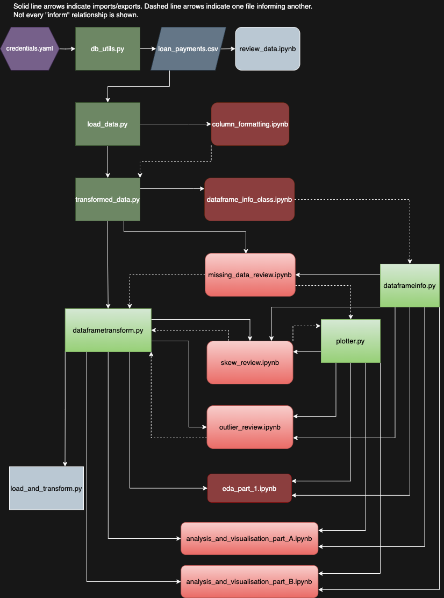

# Exploratory Data Analysis - Customer Loans in Finance

[Project Description](#project-description)\
[File Structure](#file-structure):
- [Layout diagram](#layout-diagram)
- [Python files](#python-files)
- [Jupyter notebook files](#jupyter-notebook-files)

[Installation Instructions](#installation-instructions)\
[Usage Instructions](#usage-instructions)\
[License Information](#license-information)

# Project Description
In this project, a connection to an RDS database is established, and the table loan_payments is retrieved and saved to a csv file. The data is then loaded from the csv file into a pandas dataframe and several data conversion, cleaning and transformation steps are performed. Jupyter notebook files are used to evaluate the data and develop initial methods and approaches. These methods are then written into python files, which serve as the working modules in the project. Several classes are defined in these modules to support the data analysis and transformation processes.

In the second part of the project, the untransformed data (only data type conversion and missing data cleanup are performed) is analysed to draw further insights. The analyses are performed in two jupyter notebook files, which utilise the python modules that were developed. 

# File structure

## Layout diagram
The below digram illustrates the relationships between different python and notebook files in the project folder. There is also a yaml file. File descriptions are given below this diagram.\
\
\
 \
 A higher resolution image can be seen by opening file_layout_diagram.drawio (located in diagrams_and_info) in the diagrams.net web app: [app.diagrams.net](https://app.diagrams.net/?src=about).

In the following sections, files of each type are shown in order of use. The compiled order switches between types, as seen in the above diagram.

## Python files

These are the working files. 

* **db_utils.py** 
    * Connects to RDS database, extract the data and saves it to a csv file, loan_payments.csv.

* **load_data.py** 
    * Loads data from loan_payments.csv into a pandas dataframe

* **transformed_data.py** 
    * Imports data from load_data.py. 
    * Defines the DataTransform class and uses its methods to convert data types where required. 

* **dataframeinfo.py** 
    * Defines the class DataFrameInfo, which contains methods to return (print) information about the data, including basic statistics. 

* **plotter.py** 
    * Defines the class Plotter, which contains methods to generate plots of the data and perform some statistical tests. 
    * Defines the class SkewChecker, which inherits from Plotter and contains methods to evaluate the skew of columns, and collate and display the results. 
    * Defines the class PlotStats, which inherits from Plotter and contains methods to generate box plots, add the box plot values to a dictionary and return the data. 

* **dataframetransform.py**  
    * Imports data from transformed_data.py. 
    * Defines the classes DataFrameTransform and DataFrameSliceTransform.  
    * Cleans the data, removing or imputing missing values within the loans_cleaning and loans_slice_cleaning instances. 
    * Defines functions to reduce data skew in selected columns by applying either Box-Cox or Log transformations. Options to transform a copy of the data or the original data. 
    * Defines functions to remove outliers from either a copy of the data or the original data. 
    * Defines a function to drop collinear columns from the dataframe.

* **dataframetransform_2.py**
    * This is a copy of dataframetransform.py in which some of the imputation methods used to handle missing values are altered. This was done to see if there was an impact on the analysis and visualisation section.
    * In the end this file is not used, but shows alternative imputations for funded_amount and term_months columns. 

* **load_and_transform.py**
    * Imports data from dataframetransform.py. The imported data has had data types corrected and missing values removed or imputed. 
    * Runs functions to transform skewed columns, remove outliers and drop collinear columns.
    * In the end this file is not used, because for the analysis and visualisation section the untransformed data is required.  

## Jupyter notebook files

These are the exploration and development files.

* **review_data.ipynb**
    * Simple review of initial data. The data is loaded from loan_payments.csv into a pandas dataframe for review. 

* **column_formatting.ipynb**
    * Imports data from load_data.py. 
    * Methods for the DataTransform class, to go into transformed_data.py, are developed. 

* **dataframe_info_class.ipynb**
    * Imports data from transformed_data.py.
    * The DataFrameInfo class is developed with initial methods.

* **missing_data_review.ipynb**
    * Imports data from transformed_data.py for review. 
    * The Plotter class is developed with initial methods and a review of missing data is performed. 
    * The DataFrameTransform class is developed with initial methods.
    * The DataFrameSliceTransform class is developed. 
    * Missing data removal is tested. 

* **skew_review.ipynb**
    * Imports data from dataframetransform.py.
    * The SkewCheck class (inheriting from Plotter) is developed. 
    * The data is evaluated for skew and normality, and different transformations are tested are compared.

* **outlier_review.ipynb**
    * Imports data from dataframetransform.py. 
    * Additional tranformations are applied to reduce skew in selected columns, using functions from dataframetransform.py.
    * The data is reviewed for outliers, and outlier removal is tested. Skew is also cheked, because outlier removal methods are applied only to relatively non-skewed columns. 
    * Collinearity is reviewed. 

* **eda_part_1.ipynb**
    * Summarises the steps performed to load and transform the data, including skew-reduction transformations, dropping outliers and dropping collinear columns. 

* **analysis_and_visualisation_part_A.ipynb**
    * Imports data from dataframetransform.py. 
    * Works through Tasks 1 - 2 (project milestone 4) to visualise the data and perform calculations. 

* **analysis_and_visualisation_part_B.ipynb**
    * Imports data from dataframetransform.py. 
    * Works through Tasks 3 - 5 (project milestone 4) to visualise the data and perform calculations. 

# Installation instructions
N/A

# Usage instructions
N/A

# License information
N/A